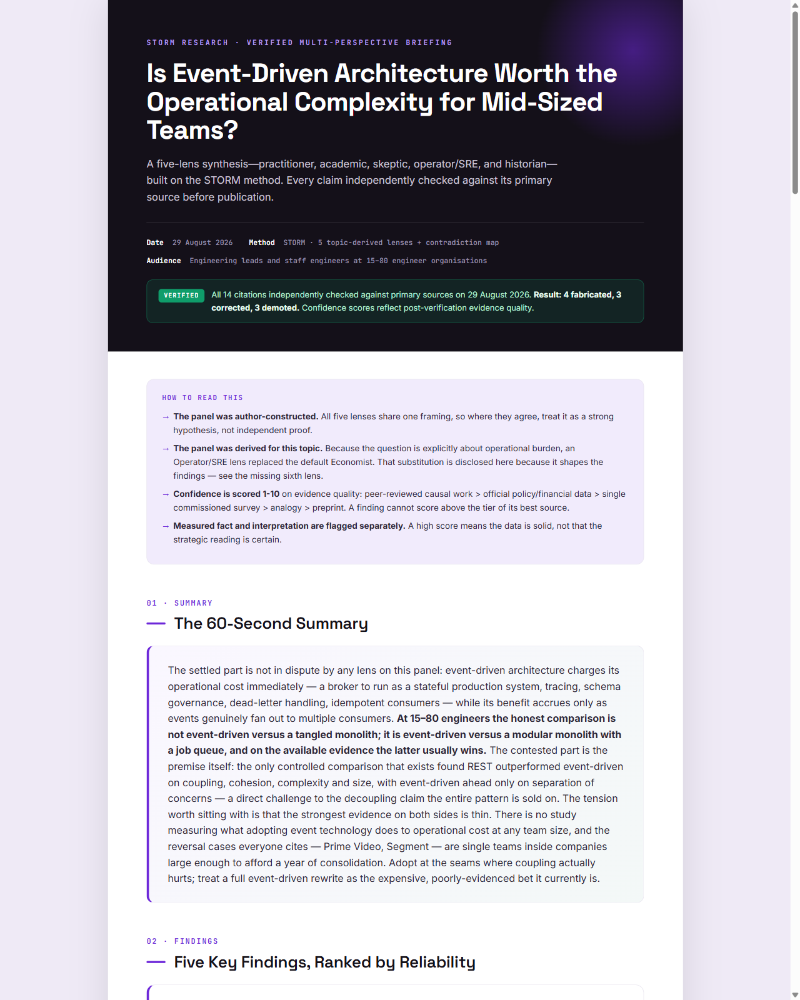
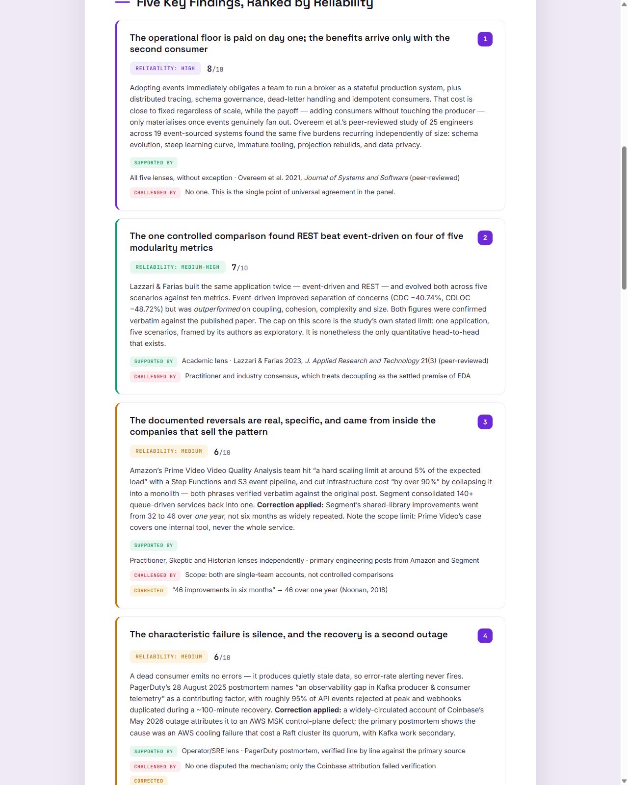
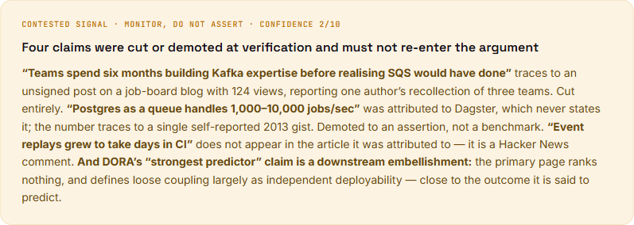

# Storm Research

**A Claude Code skill that researches a topic from five conflicting viewpoints, then tries to disprove its own citations before writing anything down.**

Ask an AI assistant a research question and you usually get one confident, well-organised answer. It reads well. It has citations. And you have no way to tell which parts are solid, which are contested, and which citation points at a page that never said what it's credited with saying.

Storm Research is built for the cases where that isn't good enough.

---

## Why Storm Research?

Conventional AI research output has four failure modes, and they compound:

- **Unearned confidence.** One voice, one narrative, no signal about which claims are load-bearing and which are guesses.
- **Manufactured consensus.** A single pass smooths over genuine disagreement between credible sources. If the literature is split, you can't tell.
- **Citations that are present but not checked.** A plausible source attached to a plausible claim is not verification. The link may resolve and still not support the sentence it's attached to.
- **No way to know what's safe to repeat.** You can't tell which sentences you could put in front of your team, and which would embarrass you.

Storm Research attacks all four by refusing to produce a single voice, and by treating its own first draft as untrusted.

---

## How It Works

**1. Five lenses research the topic in parallel.** Each is a separate agent doing live web research with its own remit:

| Lens | Remit |
|---|---|
| **Practitioner** | What hands-on operators know that commentary misses |
| **Academic** | What the peer-reviewed evidence actually shows, and where it contradicts the popular story |
| **Skeptic** | The strongest steelman case against the mainstream view |
| **Economist** | Who profits from the current narrative, and how that shapes the research |
| **Historian** | Genuine precedents, and how they actually played out |

The panel isn't fixed. Before spawning anything, the skill asks which five viewpoints *this* topic needs and substitutes where the defaults don't fit — an engineering trade-off may swap the Economist for an SRE who carries the pager; a clinical topic may want a Clinician and an Ethicist. Any substitution is disclosed in the report.

**2. The lenses are compared against each other,** not merged. The skill maps where they directly conflict, which claims are best and worst supported, what every lens agrees on regardless of position, and what none of them addressed.

**3. Findings are ranked by evidence quality** — not by how confident the writing sounds. Scores are anchored to a fixed tier system, and a finding can't score above the tier of its best source. Replicated peer-reviewed work sits at the top; a single vendor survey or a historical analogy sits near the bottom, however persuasive it reads.

---

## Self Peer-Review

This is the part that makes the output usable, and it runs before anything is rendered.

The skill first critiques its own draft — scoring each finding, naming the weakest link, and checking which lens dominated the synthesis. It then dispatches independent verification agents whose instructions are explicitly adversarial: **refute this citation, don't confirm it.** Each defaults to `UNVERIFIED` unless it reaches the primary source and sees the claim there, and is told to go looking for the strongest source that *contradicts* the claim even when it otherwise checks out.

What comes back drives real edits to the report:

- **Fabrications are cut** — claims that don't appear in the source they're credited to.
- **Figures and attributions are corrected** against the primary source.
- **Weak evidence is demoted** into a "contested signal" panel, with the reason stated.
- **Confidence scores drop** where evidence turned out thinner than it looked.

Every report carries the tally on its face. In the example below it reads:

> **4 fabricated, 3 corrected, 3 demoted**

That's one run's result, not a promise. A clean run reporting `0 fabricated, 0 corrected` is a good outcome, and the skill is explicitly instructed never to inflate the count to look rigorous.

---

## Example Research Report



> An example Storm Research report — including source verification, confidence scoring, contested claims, and research findings.

Findings carry a reliability band and a 1–10 score, with the sources that support and challenge each one, and any correction applied during verification:



Claims that failed verification aren't quietly dropped — they're named, with the reason, so they can't drift back into the argument later:



The full PDF for this run is in [`examples/`](examples/).

---

## Output

The deliverable is a designed PDF briefing, not a Markdown research dump. One report contains:

- A 60-second summary written for someone who has to make a decision
- Five findings ranked by evidence quality, each with supporting and challenging sources
- The cross-lens connection — the link only visible once all five briefs sit side by side
- Explicit consensus and disagreement, including what every lens agreed on
- Concrete next steps written for the reader's actual role
- A claim safety guide: what's safe to assert, what needs a caveat, what to avoid
- The frontier question that would change the conclusions if answered
- A reference list with per-citation verification status

Reports are written to `storm-reports/{topic-slug}-{YYYY-MM-DD}-briefing.pdf`. The intermediate HTML is a render source and is discarded.

---

## Getting Started

### Requirements

- **[Claude Code](https://claude.com/claude-code)** — uses the built-in `Agent`, `Write` and `Bash` tools plus web search/fetch. No API keys, paid services, or other skills required.
- **A Chromium-based browser** (Google Chrome or Microsoft Edge) for headless PDF rendering. Edge is preinstalled on Windows; on macOS and Linux you'll likely need to install Chrome.

### Install

Copy the `storm-research/` folder into a Claude Code skills directory:

```bash
# user-level — available in every project
cp -r storm-research ~/.claude/skills/

# or project-level — available in one project
cp -r storm-research <your-project>/.claude/skills/
```

The folder must contain both `SKILL.md` and `report-template.html`.

### Cost

A full run spawns roughly **9–11 agents** — five lenses plus one verifier per citation cluster. That's the intended trade: it's deliberately heavier than a chat answer, and it's overkill for a quick factual lookup.

---

## Example Usage

In Claude Code:

```
/storm-research Is event-driven architecture worth the operational complexity for mid-sized teams?
```

Natural language works too — *"storm report on X"*, *"make me a briefing on X"*.

The run announces its panel, reports the verification tally when it finishes, and writes the PDF to `storm-reports/`.

---

## Limitations

Worth being straight about:

- **The five lenses are constructed research perspectives, not real experts.** They share one framing and one underlying model. Where they agree, treat it as a strong hypothesis — not independent confirmation, and not consensus of the field. The reports say this on their face.
- **Reliability scoring is a heuristic.** It ranks evidence by source tier, which is a reasonable proxy for quality and not a measurement of truth.
- **Web research still misses things.** Paywalled literature, sources behind bot protection, and anything not well indexed can be absent without the report knowing it's absent.
- **Verification reduces errors; it does not guarantee truth.** It catches fabricated and misattributed citations and forces corrections. A claim that survives verification is better supported, not proven.
- **Runs are not deterministic.** Two runs on one topic will surface overlapping but different sources, and different verification tallies.

---

## Inspiration

The multi-perspective method is inspired by Stanford's **STORM**:

> Shao et al., *Assisting in Writing Wikipedia-like Articles From Scratch with Large Language Models*, NAACL 2024 — [OVAL Lab, Stanford University](https://github.com/stanford-oval/storm) · [storm.genie.stanford.edu](https://storm.genie.stanford.edu)

**This project is not Stanford's STORM and is not affiliated with it.** It borrows one idea — that good research comes from multiple perspectives interrogating a topic rather than a single retrieval pass — and builds something different around it:

- Adversarial primary-source verification with fabrication detection, which STORM does not do
- Evidence-tier confidence scoring and a claim safety guide
- A designed PDF report as the deliverable
- Built specifically as a Claude Code skill, using its native agent and tool model

STORM's published benchmark results measure Stanford's system, not this one, and are not claimed here.

---

## Repository Structure

```
storm-research/
  SKILL.md              the pipeline, lens prompts, and guardrails
  report-template.html  the PDF design template
docs/                   report preview images used in this README
examples/               a full generated briefing
```

---

## License

No license file is currently included in this repository. Without one, default copyright applies and others have no explicit permission to reuse or modify the code — adding a `LICENSE` file (MIT is the usual choice for a skill like this) is worth doing before promoting the project publicly.
